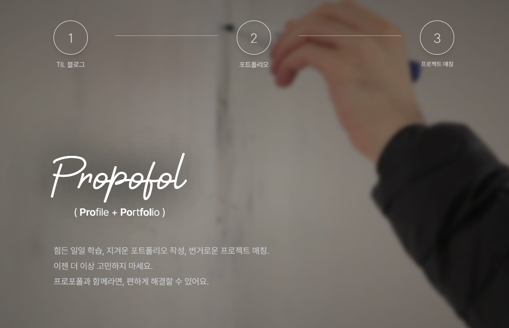
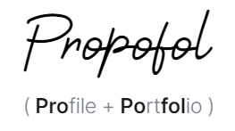

# Propofol

## 프로젝트 소개

- 프로포폴(Propofol)은 블로그, 포트폴리오 관리, 프로젝트 매칭이라는 세 가지 기능으로 개발자의 경력 개발을 돕는 웹 서비스입니다.
- Propofol = Profile + Portfolio

## 사용 기술

### Front-end 개발

  

### 버전 관리

  
  

### 개발 환경

  

### 디자인

  

## 화면 구성 및 기능

### 메인 페이지, 로그인, 회원가입

| 메인 페이지                                  | 로그인                                 | 회원가입                                     |
| -------------------------------------------- | -------------------------------------- | -------------------------------------------- |
|  |  |  |

- 메인 페이지에선 각 기능에 대해 간단하게 소개하고 있으며, 사용자는 상단의 헤더로 각 기능에 접근하거나 로그인, 회원가입을 할 수 있습니다.

### 블로그

| 메인 페이지                                  | 스트릭(잔디밭) 기능                      |
| -------------------------------------------- | ---------------------------------------- |
|  |  |

- 블로그 메인 페이지에선 스트릭(잔디밭), 팔로워, 본인이 작성한 글 목록이 제공되며, 글 작성 버튼과 검색 버튼을 통해 각 기능에 접근할 수 있습니다.
- 스트릭의 각 칸에 마우스를 가져다대면 해당 날짜에 글을 몇 개 작성했는지 알 수 있습니다.

| 글 작성 페이지                           | 태그 모달                          |
| ---------------------------------------- | ---------------------------------- |
|  |  |

- 글 작성 페이지입니다. 에디터는 글꼴, 글씨 크기 등 글씨나 문단을 조정하는 옵션을 제공하며, 이미지 첨부, 코드 블럭 기능 역시 제공되며, 각 언어에 맞는 하이라이트가 제공됩니다.
- 우하단의 태그 버튼을 통해 태그 모달을 띄울 수 있습니다. 태그 모달에선 페이지를 옮기거나 검색을 통해 자신이 원하는 태그를 찾고 선택할 수 있습니다.

| 글 조회 페이지                               | 검색 페이지                                      | 댓글, 좋아요, 팔로우                       |
| -------------------------------------------- | ------------------------------------------------ | ------------------------------------------ |
|  |  |  |

- 글 조회 페이지입니다. 코드 블럭 아래에는 언어를 선택할 수 있는 버튼과 컴파일 버튼이 있으며, 올바른 언어를 선택 후 컴파일을 누를 시 서버에서 컴파일한 결과를 하단에 출력합니다.
- 검색은 태그, 제목을 통해 가능합니다.
- 글 조회 페이지에서 하단으로 내려가면 댓글, 좋아요, 팔로우 기능을 볼 수 있습니다. 우하단의 하트 버튼이 '좋아요' 버튼이고, 바로 옆의 버튼이 '팔로우(구독)' 버튼입니다. 바로 위에 있는 input 칸에 텍스트를 작성 후 '댓글 작성' 버튼을 누르면 작성이 완료됩니다. 또한 '답글 달기' 버튼을 통해 답글을 달 수도 있습니다.

### 포트폴리오 관리

| 메인 페이지                              | 템플릿 선택                                  | 생성 결과                                    |
| ---------------------------------------- | -------------------------------------------- | -------------------------------------------- |
|  |  |  |

- 포트폴리오 메인 페이지에선 아직 포트폴리오를 생성하지 않은 경우 새롭게 정보를 입력하거나, 이미 생성한 경우 기존 정보를 수정할 수 있습니다. 만들고 싶은 포트폴리오의 템플릿을 선택하고 생성 버튼을 누르면 생성 결과 페이지로 이동합니다. 생성 결과 페이지에선 템플릿에 맞춰 생성된 포트폴리오와, 해당 포트폴리오를 pdf로 다운받을 수 있는 버튼이 제공됩니다.

### 프로젝트 매칭

| 메인 페이지(프로젝트 추천)               | 개인 시간표 생성                     |
| ---------------------------------------- | ------------------------------------ |
|  |  |

- 프로젝트 매칭 메인 페이지에선 사용자의 블로그를 기반으로, 해당 사용자가 많이 등록한 상위 태그 정보에 맞는 프로젝트들을 추천해줍니다. 사용자는 키워드 검색 및 태그 검색 기능을 통해 원하는 프로젝트를 검색할 수 있으며, 새 프로젝트 모집 및 내 프로젝트 보기 기능을 통해 모집 중이거나 지원한 프로젝트 목록을 확인할 수 있습니다.
- 또한 나의 시간표 버튼을 눌러 개인 시간표 생성 페이지로 이동할 수 있습니다. 시간표 생성 페이지에선 [요일, 시작 시간, 끝나는 시간]으로 이루어진 '일정'을 추가해 시간표를 채울 수 있고, 기존 일정을 삭제할 수도 있습니다.

| 프로젝트 생성                        | 팀 시간표 생성                               | 모집 중인 프로젝트                     |
| ------------------------------------ | -------------------------------------------- | -------------------------------------- |
|  |  |  |

- 프로젝트 생성 페이지에선 마찬가지로 에디터가 제공되며, 상단의 태그 추가 버튼(+)을 통해 태그를 추가할 수 있습니다. 또한 '팀 시간표 생성' 버튼을 통해 팀 시간표 생성 모달을 띄울 수 있으며, 생성한 후에는 해당 버튼이 '팀 시간표 조회' 버튼으로 바뀝니다.
- 생성이 완료된 프로젝트들은 '모집 중인 프로젝트' 에서 확인할 수 있습니다. 제목을 눌러 팀 관리 페이지로 이동할 수 있습니다.

| 팀원 추천                                  | 참여 중인 팀원                           | 지원자 보기                            |
| ------------------------------------------ | ---------------------------------------- | -------------------------------------- |
|  |  |  |

- 팀 관리 페이지입니다. 우상단의 버튼을 통해 시간표 수정, 프로젝트 수정, 프로젝트 삭제, 모집 완료를 할 수 있습니다.
- 하단의 [팀원 추천, 참여 중인 팀원, 지원한 개발자들] 중 하나를 선택해 원하는 정보를 볼 수 있습니다. 팀원 추천에선 프로젝트의 기술 스택과 일치하는 개발자들을 나열합니다. 각 지원자들과 팀원들의 시간표, 포트폴리오를 확인해 일정을 조율하거나 기술 스택을 추가적으로 검토할 수 있습니다. 지원한 개발자들에 대해선 수락이나 거절을 할 수 있습니다.

| 프로젝트 검색(태그)                          | 프로젝트 상세 보기                           |
| -------------------------------------------- | -------------------------------------------- |
|  |  |

- 프로젝트 검색은 태그, 제목을 통해 가능합니다.
- 검색 결과나, 메인 페이지에서 추천해주는 프로젝트의 제목을 눌러 프로젝트 상세 보기 페이지로 이동할 수 있습니다. 해당 페이지에선 프로젝트의 상세 정보가 출력되며, 팀장의 프로필, 포트폴리오를 확인할 수 있습니다. '지원하기' 버튼을 통해 지원할 수 있습니다.

### 알림

| 알림(블로그)                             | 알림(프로젝트)                             |
| ---------------------------------------- | ------------------------------------------ |
|  |  |

- 블로그에선 구독, 댓글, 추천 정보를 알림으로 받을 수 있고, 프로젝트에선 신청한 프로젝트에서의 승인 혹은 거절, 팀원의 탈퇴, 내가 모집중인 프로젝트에 대한 신청 정보를 알림으로 받을 수 있습니다.
- 알림이 새로 생겼을 때 헤더의 우측에 있는 종 모양 버튼에 빨간 점이 생깁니다. 해당 버튼을 눌러 알림을 확인할 수 있으며, 확인이 완료되면 빨간 점은 사라집니다.
